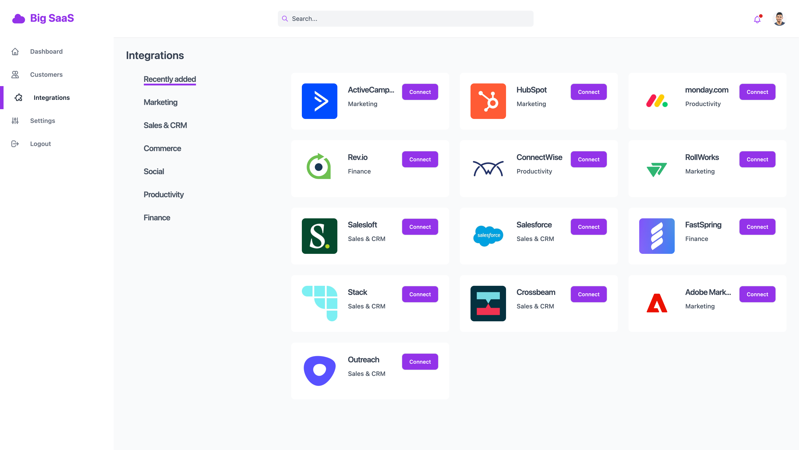

# Quick Start

### Getting Started

Let’s test out running Frigg locally by cloning a quick start app. Make sure you have [node and npm installed](https://docs.npmjs.com/downloading-and-installing-node-js-and-npm) before following along.&#x20;

The quick start guide will provide a demo user account and API keys, however to create your own users you will also need to either [install MongoDB](https://www.mongodb.com/docs/manual/installation/) or create a cluster through [MongoDB Atlas](https://www.mongodb.com/atlas/database).

The quick start app will give you a brief overview of how a Frigg component is implemented within a SaaS. It will generate a dummy SaaS app with a variety of API modules already installed.&#x20;

Clone and run quick start app&#x20;

`git clone https://github.com/friggframework/frigg.git`&#x20;

`cd frigg/backend`&#x20;

`cp .env.example .env`&#x20;

`npm install`&#x20;

`npm run start:dev`

Open a new shell and start the frontend app. Your app will be running at http://localhost:3000.

`cd frigg/frontend`&#x20;

`npm install`&#x20;

`npm run start`

Go to http://localhost:3000.

### Exploring the quick start app

Once you are up and running, you'll notice the ability to login using a demo account. Go ahead and login. You'll be directed to a dummy SaaS dashboard in where you'll be able to navigate to the `Integrations` tab.&#x20;

Once on the integrations page, you'll see Frigg's available integrations load through an `<IntegrationList />` component. This is the component that will live inside of your app.

### How it works

As you might have noticed, you use both a [serverless](https://aws.amazon.com/serverless/) instance and a client side react app to access the Frigg API modules. The flow looks like this:

